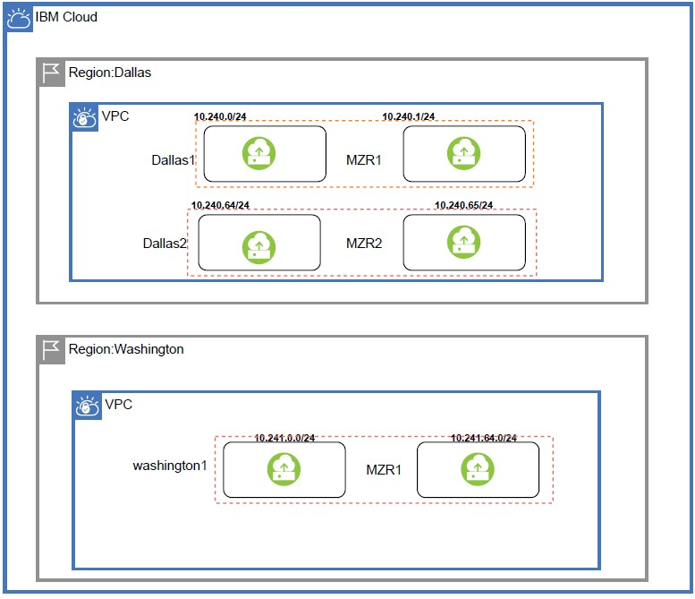
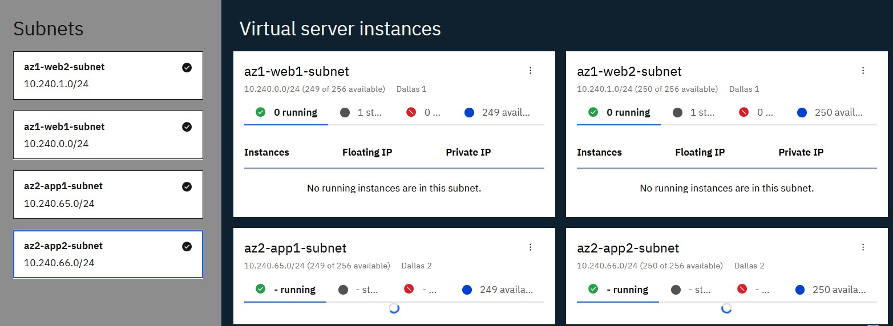

import Globals from 'gatsby-theme-carbon/src/templates/Globals';

<PageDescription>

</PageDescription>

## Introduction
IBM Cloud® Virtual Private Endpoints (VPE) for VPC enables you to connect to supported IBM Cloud services from your VPC network by using the IP addresses of your choosing, allocated from a subnet within your VPC.

VPE is an evolution of the private connectivity to IBM Cloud services. VPEs are virtual IP interfaces that are bound to an endpoint gateway created on a per service, or service instance, basis (depending on the service operation model). The endpoint gateway is a virtualized function that scales horizontally, is redundant and highly available, and spans all availability zones of your VPC. Endpoint gateways enable communications from virtual server instances within your VPC and IBM Cloud® service on the private backbone. VPE for VPC gives you the experience of controlling all the private addressing within your cloud.

For more details refer: https://cloud.ibm.com/docs/vpc?topic=vpc-about-vpe

In this recipe I will start with a reference architecture start which I will Implement to conform to certain use case.

## Use Cases
In this use case I will be sharing the data across availability zones in VPC and DR site using IBM Cloud object storage where in DC is located in Dallas region and DR is located in Washington region. I will mount cloud object storage bucket across regions and within region to actively share the data.

## VPC - DC and DR Architecture

## DC Implementation Architecture in IBM Cloud Console

