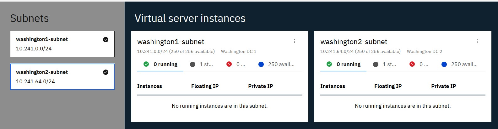
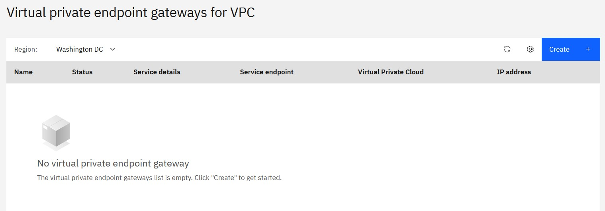

import Globals from 'gatsby-theme-carbon/src/templates/Globals';

<PageDescription>

</PageDescription>

## Introduction
IBM Cloud® Virtual Private Endpoints (VPE) for VPC enables you to connect to supported IBM Cloud services from your VPC network by using the IP addresses of your choosing, allocated from a subnet within your VPC.

VPE is an evolution of the private connectivity to IBM Cloud services. VPEs are virtual IP interfaces that are bound to an endpoint gateway created on a per service, or service instance, basis (depending on the service operation model). The endpoint gateway is a virtualized function that scales horizontally, is redundant and highly available, and spans all availability zones of your VPC. Endpoint gateways enable communications from virtual server instances within your VPC and IBM Cloud® service on the private backbone. VPE for VPC gives you the experience of controlling all the private addressing within your cloud.

For more details refer: https://cloud.ibm.com/docs/vpc?topic=vpc-about-vpe

In this recipe I will start with a reference architecture start which I will Implement to conform to certain use case.

## Use Cases
In this use case I will be sharing the data across availability zones in VPC and DR site using IBM Cloud object storage where in DC is located in Dallas region and DR is located in Washington region. I will mount cloud object storage bucket across regions and within region to actively share the data.

## VPC - DC and DR Architecture

## DC Implementation Architecture in IBM Cloud Console

## DR Implementation Architecture in IBM Cloud Console

## Adding VPE Gateway 

IBM Cloud® Virtual Private Endpoint (VPE) for IBM Cloud™ Virtual Private Cloud provides connection points to IBM services on the IBM private network from your VPC network. VPE has multiple benefits like:

    Public connectivity is not required and has no public data egress charges.
    Reaches IBM Cloud assets through a private service provider.
    A VPE lives in your network address space, extending your private and multicloud into the IBM Cloud.
    You can apply security through Network Access Control Lists (NACLs).
    The endpoint IP deploys in a customer-defined, virtual network.
    Includes platform integration to VPC – Identity and Access Management (IAM), network ACLs, and tagging.
    Access to new endpoints is achieved through the UI, CLI, and API.
    You can map a new endpoint to an existing service, as well as map to a shared endpoint.
    Integrates with DNS Services.

 

The COS bucket is already set up in US region as multi-region and to share bucket across compute instances in DC and DR. I will not cover the details of configuring COS in this article. To mount these buckets in compute instances across regions over the private network, we have to setup VPE. For this one would need to be aware of end-point URL of COS bucket.

## Step1

